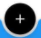
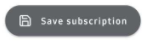
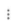

# Installation

To install this application please visit [Google Playstore](https://www.justinclicks.com)
Now click on Install. Now your app will start Download. 
Wait while the app is downloaded and beign installed.
Once App is installed, you will see Open button as well as you will get option in apps to open. Now open app to get started.
[Note App is currently available only for Android]

[](https://google.vom)


# Selecting Currency

  When you open app for first time you can select Currency. You can also change that later
  To change default currency click on three lines in bottom-left corner . Now click on  ```Default currency : ``` and select the currency you want from given list.
 >


# Adding New Subscription

To add new subscription click on   button on dashboard.
Now enter below details

| Field  | Type | Content|
| ------------- | ------------- | ------------- |
| Amount  | Required  | Amount/Price of Subscription  |
| Name  | Required  | Enter Subscription Name  |
| Description  | Optional  | Description of subscription  |
| Expiry Date  | Optional  | Enter Subscription Expiry date |
| Color  | Optional  | Give color for identification  |
| Payment Method | Optional  | Payment Method used for making subscription payment  |
| Note | Optional  | Note for subscription  |
| Labels | Optional  | Labels if any  |

Some fields are different for ```One time Subscriptions```

After completing above details. click on "Save Subscription" 
>
Done! You have added your first subscription.


# Deleting Subscription

Deleting a subscription is very easy.
To delete a subscription
Go To Dashboard/Home Page -> Now Click on Subscription you want to delete and click on three dots  in top right corner. Now Click on Remove button.
Once you click on remove you will see
> ```Delete Subscription?```
Now Click on ```DELETE``` Button.


# Adding Feedback About App

Your feedback/ideas/suggestions are very important for us. To add feedback click on three lines in bottom-left corner .  Now Click on last option ```Leave Feedback```.
>
Or You can directly add your feedback  [here.](https://go.justinclicks.com/feedback/subscription-manager/)
 
# To Select App Theme

To select app theme click on three lines in bottom-left corner . after click on ```Select App Theme```. Select theme as per your convenience.
>
| Mode |  Working|
| ------------- | ------------- |
| System Dark Mode   | This will select Dark mode option from your system dark mode.  |
| Dark Mode disabled  | This will disable dark mode.  |
| Dark Mode enabled    | This will enable dark mode.  |


# Backing up Your Data

We know your data is important for you. That's why we provide you Google Drive Backup and Local backup via Exporting to Excel.

To create Google Drive Backup, click on three lines in bottom-left corner .
Now Click on Backup. Now it will ask you for selectig Google Account for your Google Data Backup Account. Select and Click on allow.
and from next time you just need to click on Backup for backing up and Restore for restoring backup.
>
If you just want to take Local Backup. You need to give storage permission and click on Local backup.
>
If By Mistake you click on Deny then you can enable permission from Mobile Settings.
<ul>
<li>To enable Go to Settings--> Apps --> Subsription Manager --> Permissions --> Storage Permission --> Allow</li>
</ul>
Done you've added permission for app.

>```[NOTE : WE DO NOT HAVE ANY ACCESS TO YOUR DATA. WE DO NOT SELL/SHARE YOUR DATA . TO KNOW MORE READ OUR PRIVACY POLICY]``` [Privacy Policy](https://apps.justinclicks.com/android/com.justinclicks.subscriptionmanager/privacy-policy/index.html)

# Contact us

Problem NOT solved yet? Don't worry we're here to help you out. you just need to [Contact us](https://apps.justinclicks.com/android/com.justinclicks.subscriptionmanager/privacy-policy/index.html)


